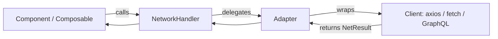

# TV Explorer


TODO: Need to add nvmrc - node version 22 crypto.hash fails on node 18
[add bug report]()


TODO: Lets add es lint support

<!-- https://primevue.org/theming/unstyled/ -->
add architectural reasoning behind unstyled components

## Prime vue


## Vite config
add documentation entry for how to extend alias via vite config and make sure to include same details for tsconfig.app.json

```json
 {
    "resolve" : {
    "alias" : {
       '@': path.resolve(__dirname, 'src'),
      '@components': path.resolve(__dirname, 'src/components'),
      '@views': path.resolve(__dirname, 'src/views'),
      '@assets': path.resolve(__dirname, 'src/assets'),
      '@styles': path.resolve(__dirname, 'src/styles'),
      '@utils': path.resolve(__dirname, 'src/utils'),
      '@store': path.resolve(__dirname, 'src/store'),
      '@api': path.resolve(__dirname, 'src/api'),
    }
  }
 }
 ```


## Design Tokens & CDN
To ensure consistency, flexibility, and vendor independence, the project uses a tokens.css file that defines all core design primitives (colors, spacing, typography, radius, shadows, etc.).

### Why this approach?
- Single source of truth → all Tailwind utilities (bg-bg, text-text, spacing-sm, etc.) map back to these tokens.
- Decoupled from the app build → tokens are not hard-coded into Tailwind config; instead, they are read from tokens.css at runtime.
- CDN-ready → the tokens file can be hosted on a CDN or storage bucket (e.g., Azure Blob, S3). Teams can update brand colors or spacing scales without rebuilding the app.
- Multi-brand support → by swapping token URLs, the same codebase can instantly switch to another theme
- Design system alignment → this matches strategy of styled vs. unstyled components (job spec [436]) and ensures Tailwind + PrimeVue components can inherit styles consistently.

#### Example
```css
:root {
  --color-primary: #0052cc;
  --color-accent: #ff6f00;
  --color-bg: #ffffff;
  --color-text: #1a1a1a;

  --spacing-xs: 0.25rem;
  --spacing-sm: 0.5rem;
  --spacing-md: 1rem;
  --spacing-lg: 2rem;
}
```

```ts
// tailwind.config.js where applicale (v3)

// for v4 plese refer to @assets/styles/foundations.css
theme: {
  extend: {
    colors: {
      primary: 'var(--color-primary)',
      accent: 'var(--color-accent)',
      bg: 'var(--color-bg)',
      text: 'var(--color-text)',
    },
    spacing: {
      xs: 'var(--spacing-xs)',
      sm: 'var(--spacing-sm)',
      md: 'var(--spacing-md)',
      lg: 'var(--spacing-lg)',
    },
  },
}
```

#### How to override via CDN
- Publish tokens.css to a CDN or storage bucket.
- Update your index.html or preview.ts (for Storybook):
TODO: Add env variable support to ensure we can set this on build time.
`<link rel="stylesheet" href="https://cdn.example.com/design-system/tokens.css" />
`
- Reload → your app adopts the new theme instantly.

## Network Handler
The `NetworkHandler` and `Adapterz` classes form a lightweight abstraction layer over network requests.
Instead of scattering `axios` or `fetch` calls throughout the app, all requests are centralized, typed, and reusable.

### Why this approach?
- **Security:** Each service (TV API, Auth API, etc.) can have its own singleton client and token management.
- **Consistency:** Every request resolves to the same NetResult shape ({ data, status, headers }), no matter if it comes from axios, fetch, or another library.
- **Developer Experience:** Requests are strongly typed, so when you call a service method you get autocompletion and correct return types.
- **Reusability:** Adding a new service only requires defining an adapter and registering its endpoints — the rest of the app consumes clean service methods like tvService.getShows()
- **Testability:** The NetworkHandler is easily testable, and can be mocked for unit tests.
- **Portable:** : This design can be droped in into any framework or library with tiny changes and carry the same imlementation.

## Pluggable fetcher
This design is fetcher-agnostic.
While the example uses an axios singleton, the adapter can wrap any network client:

- fetch
- axios
- GraphQL clients
- Even mocked local json for testing.

As long as the adapter returns a NetResult, it works with NetworkHandler out of the box.

👍
### Example: Axios Singleton + Adapter


```typescript
// api/clients.ts
import axios from 'axios';
export const tvApi = axios.create({
  baseURL: 'https://api.tvmaze.com',
  timeout: 10000,
});
export function setTvToken(t: string) {
  tvApi.defaults.headers.common['Authorization'] = `Bearer ${t}`;
}

// services/tv.adapter.ts
import { Adapter, type NetResult, type RequestFn } from './NetworkHandler';
type Show = { id: number; name: string };
type TvRequests = {
  getShows: RequestFn<{ page?: number }, Show[]>;
  getShowById: RequestFn<{ id: number }, Show>;
  searchShows: RequestFn<{ q: string }, { score: number; show: Show }[]>;
};
export const tvAdapter = new Adapter<TvRequests>({
  async getShows(params) {
    const res = await tvApi.get<Show[]>('/shows', { params: { page: params?.page ?? 0 } });
    return { data: res.data, status: res.status, headers: res.headers as any } satisfies NetResult<Show[]>;
  },
  async getShowById({ id }) {
    const res = await tvApi.get<Show>(`/shows/${id}`);
    return { data: res.data, status: res.status, headers: res.headers as any } satisfies NetResult<Show>;
  },
  async searchShows({ q }) {
    const res = await tvApi.get(`/search/shows`, { params: { q } });
    return { data: res.data, status: res.status, headers: res.headers as any } satisfies NetResult<any>;
  },
});

// usage in a component/composable
const nh = new NetworkHandler(tvAdapter);
const shows = nh.useRequest('getShows', { page: 0 }, { retry: 2, retryDelayMs: 300 });
// onMounted(() => shows.run());
// template: shows.loading / shows.data / shows.error
```

### Request Flow



